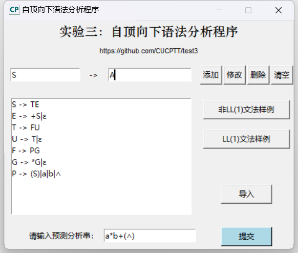

# 实验三：自顶向下语法分析程序

## 实验环境

- Python 3.11.4
- pipenv

## 主要内容

1. 任给一上下文无关文法，`判断是否为 LL(1) 文法`；
2. 若是 LL(1) 文法，`采用预测分析法或递归下降法进行语法分析`；
3. 若不是 LL(1) 文法，`判断是否有左公因子或左递归`；
   - 若存在这些特点则进行 `文法改造`；
   - 再次调取 `判断是否为 LL(1) 文法`，若不是则放弃。


## 图形界面



- **添加**：添加指定格式文法至 ListBox
- **修改**：对于 ListBox 内选中项目，修改其为当前输入框内文法
- **删除**：删除 ListBox 内选中项目
- **清空**：清空 ListBox 及所有输入框内容
- **非 LL(1) 文法样例**：导入 `《编译原理》第3版 P99:1.` 样例和对应预测分析串样例
- **LL(1) 文法样例**：导入 `经修改的《编译原理》第3版 P100:2.` 样例和对应预测分析串样例
- **导入**：支持读入文档逐行导入符合 `text1 -> text2` 规则的上下文无关文法至 ListBox
- **提交**：启动语法分析流程

## 方法模块

- **def Is_LL1(grammar):**
  - `grammar` 上下文无关文法列表
  - `return boolean` 是否为 LL(1) 文法
- **def analyse(grammar, str):**
  - `grammar` LL(1) 文法列表
  - `str` 待分析的预测字符串
  - `tkinter.Treeview` 以表格形式展示预测分析过程
  - `return void`
- **def left_common_factor_or_recursion(grammar):**
  - `grammar` 非 LL(1) 文法列表
  - `return boolean` 是否存在左公因子或左递归
- **def reform(grammar):**
  - `grammar` 存在左公因子或左递归的文法列表
  - `return new_grammar` 改造后的文法列表

## 数据格式

- 至多支持 `[A-Z]` 即 `26` 种大写字母的非终结符表示

```python
# 文法列表存储二元元组：[('非终结符','对应产生式')]
# 《编译原理》第3版 P99:1. 非 LL(1)文法
grammar = [('S','a|∧|(T)'),('T','T,S|S')]
# 等同于 G[S]:
# S -> a|∧|(T) 
# T -> T,S|S
# 改编自《编译原理》第3版 P100:2. LL(1)文法
grammar = [('S','TE'),('E','+S|ε'),('T','FU'),('U','T|ε'),
    ('F','PG'),('G','*G|ε'),('P','(S)|a|b|∧')]
```

## 运行说明

```python
# 如果没有安装过 pipenv
pip install pipenv

# 安装所有依赖
pipenv install

# 进入 pipenv 环境
pipenv shell

# 启动程序
python main.py
```